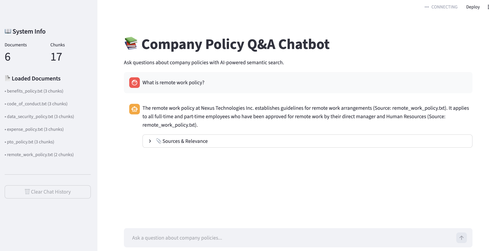

# Company Policy Chatbot — Document Q&A with RAG

An AI-powered Q&A chatbot that answers employee questions about company policies using **Retrieval-Augmented Generation (RAG)** — combining semantic search with LLM generation to deliver accurate, source-cited answers through a conversational Streamlit interface.



## Results

- Answers questions with **source citations** pointing to the exact policy document used
- Semantic search retrieves relevant policy sections by *meaning*, not just keywords — e.g., asking about "working from home" correctly surfaces the remote work policy
- Tested against 8 diverse questions spanning all 6 policy areas with accurate, grounded responses

## How It Works

```
User Question → Embed → Semantic Search → Retrieve Top Chunks → Prompt + Context → Gemini → Answer + Citations
```

1. **Load** 6 company policy `.txt` files using LlamaIndex's `SimpleDirectoryReader`
2. **Chunk** each document into searchable pieces using `SentenceSplitter` (512 chars, 50-char overlap)
3. **Embed** all chunks into 384-dimensional vectors using HuggingFace `bge-small-en-v1.5`
4. **Index** vectors in a `VectorStoreIndex` for fast cosine similarity search
5. **Search** for the most relevant chunks when a user asks a question
6. **Generate** an answer using Google Gemini with the retrieved context
7. **Cite** which policy document(s) the answer came from

## Built With

| Tool | Purpose |
|------|---------|
| **LlamaIndex** | RAG framework — document loading, chunking, indexing, retrieval |
| **HuggingFace bge-small-en-v1.5** | Local embedding model (384-dim vectors, ~130MB) |
| **Google Gemini 2.0 Flash** | LLM for answer generation |
| **Streamlit** | Chat UI with session state, sidebar, and message history |
| **Python 3.12** | Core language |

## Dataset

6 company policy documents for Nexus Technologies Inc. (fictional):

| Document | Topics Covered |
|----------|---------------|
| `remote_work_policy.txt` | Eligibility, schedule, workspace, equipment, in-office requirements |
| `expense_policy.txt` | Travel, meals, approval limits, submission process, non-reimbursable items |
| `pto_policy.txt` | Vacation, sick days, personal days, holidays, parental leave, bereavement |
| `benefits_policy.txt` | Health/dental/vision insurance, 401(k), life insurance, ESPP, wellness |
| `code_of_conduct.txt` | Workplace behavior, harassment, conflicts of interest, confidentiality |
| `data_security_policy.txt` | Passwords, device security, VPN, email security, incident reporting |

## Getting Started

### 1. Install dependencies

```bash
pip install -r requirements.txt
```

### 2. Set up your API key

```bash
cp .env.example .env
# Add your Google Gemini API key
# Get a free key at: https://aistudio.google.com/apikey
```

### 3. Run the chatbot

```bash
streamlit run qa_app.py
```

The HuggingFace embedding model downloads automatically on first run (~130MB). The semantic search pipeline works **without** an API key — you only need one for Gemini answer generation.

## Project Structure

```
project-5/
├── data/
│   └── policies/              ← 6 company policy .txt files
├── document_qa.py             ← RAG engine (loading, chunking, search, generation)
├── qa_app.py                  ← Streamlit chat interface
├── architecture.svg           ← RAG pipeline diagram
├── requirements.txt
└── README.md
```

## Key Concepts

- **Embeddings** — Numerical vectors capturing text meaning. Similar texts produce similar vectors. `bge-small-en-v1.5` outputs 384-dimensional vectors that run entirely locally.
- **Semantic Search** — Unlike keyword matching (TF-IDF), embedding-based search finds results by *meaning*. Querying "guarantee" can surface text about "warranty."
- **Chunking** — Documents are split into smaller pieces so retrieval returns specific, relevant sections rather than entire files.
- **RAG** — Retrieval-Augmented Generation: retrieve relevant context first, then generate an answer with an LLM. This keeps responses grounded in actual documents and reduces hallucination.

## Example Questions

- "How many vacation days do I get as a new employee?"
- "Can I expense a conference registration fee?"
- "What is the policy on working from home?"
- "What happens if I lose my company laptop?"
- "How do I report harassment?"
- "What does the 401(k) match look like?"
